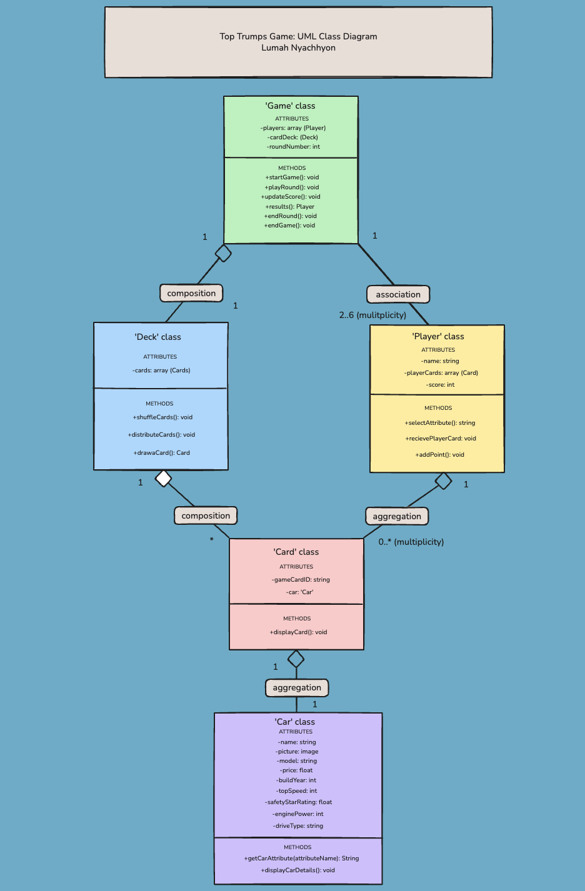
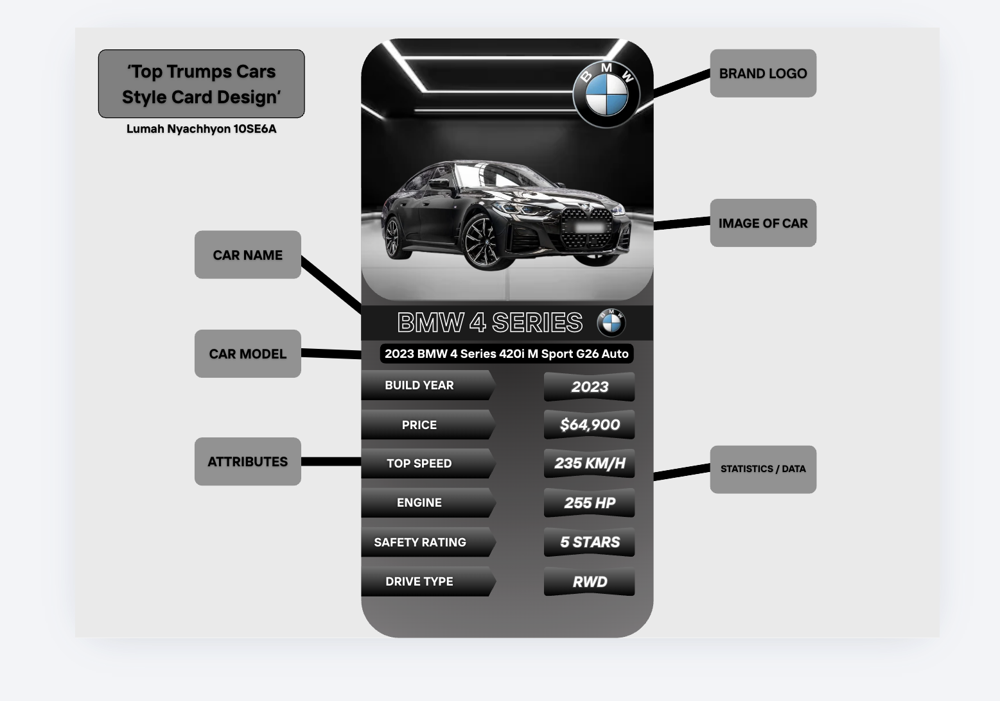
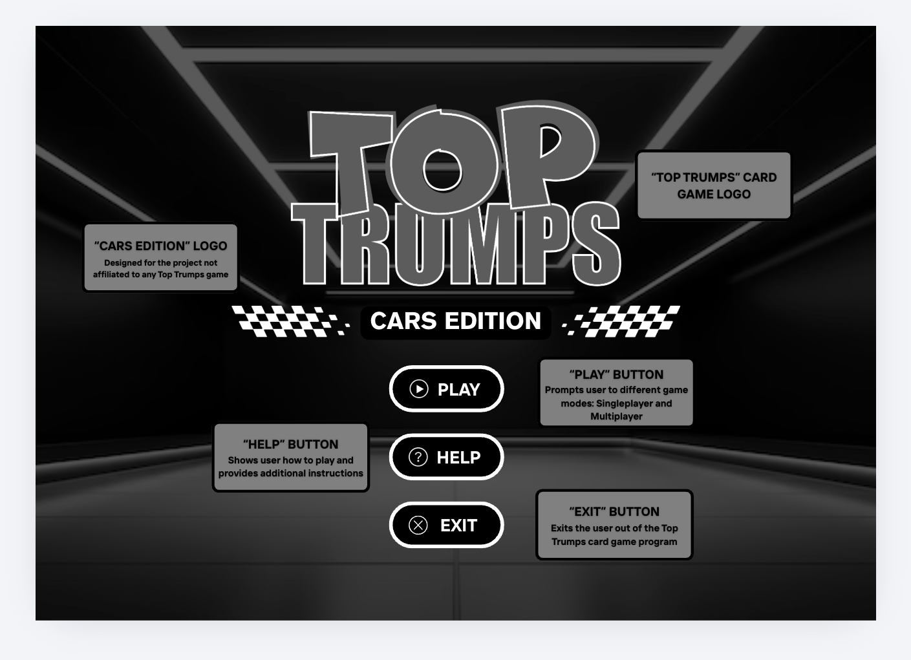
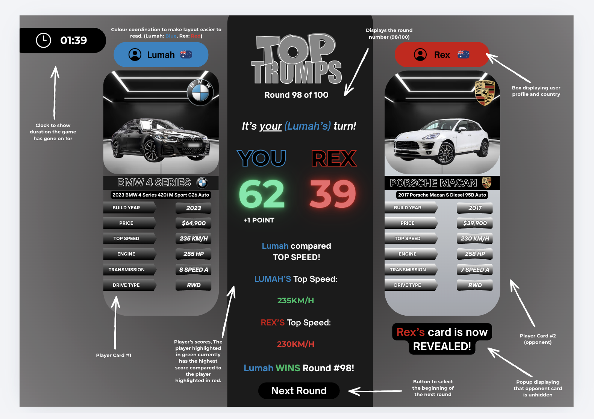

# 10SE6A Task 2 - Project Documentation

In this Assessment Task 

## Part A - Data Selection & Game Attributes

### Data Selection (implemented with Examples:)

For each card's statistics I've selected easy-to-understand attributes that each player, even many that aren't familiar with vehicles can interpret or easily get to understand. These specifications include: Build Year, Price, Top Speed, ANCAP Safety Ratings, Engine, and Drive Type. 

Two tables that display attributes both an example and an additional table portraying an example of a real car.

|Attributes     |Example        |
|-------------------|-------------|
|Build Year         |Year (e.g 2000)       |
|Price              |Price (e.g $100,000)      |
|Top Speed          |Kilometres (e.g 120 KM/H)            |
|Safety Rating       |Safety Rating Stars (e.g 5 STARS)  |
|Engine    |(e.g 250 HP)         |
|Drive Type  |(e.g 4WD)|

An example of a 'real' car including authentic attributes would include:

**Example Car:** *2020 Volvo XC60 T6 R-Design Auto*
|Attributes     |Example        |
|-------------------|-------------|
|Build Year         |2020       |
|Price              |$37,000      |
|Top Speed          |180 KM/H            |
|Safety Rating       |5 STARS |
|Engine    |316 HP         |
|Drive Type  |AWD|

### Game Attributes (Ranked from the most powerful to the least powerful)
**Engine (HP):** For my first and most powerful game attribute, I chose Engine Power. Engine Power is strong in Top Trumps as it is an easily comparable unit due to diverse performance in cars with horsepower directly affecting how fast and powerful a car is. However, measuring engine can be unfair as sports cars will almost always surpass regular everyday or family cars in this category.

**Top Speed:** For my second attribute, I chose Top Speed. Top Speed is another performance based attribute which shows how the limit to how fast the car can travel. Top Speed is a strong category for Top Trumps as it is easy to rank amongst cars, however it can also be unfair as like Engine Power, this attribute also favours sporty and high-performing cars.

**Build Year:** For my third attribute, I chose to add the Build Year. The Build Year attribute, unlike Engine and Top Speed, does not support higher performance cars over other vehicles. It is a good choice for Top Trumps as it displays how new a car is, using improvements factors like efficiency, safety, design and technology. It is a fair aspect however it can be unfair towards older model cars that are higher in quality.

**Price:** For my fourth attribute, I chose Price. Price is a more useful attribute in the Top Trumps game as it portrays the car's market value, making it easier to compare the different cars. It also adds a realistic detail to Top Trumps but it can be an unfair feature because more expensive cars can usually win if cost is picked over a performance or safety category.

**ANCAP Safety Rating:** For my fifth attribute, I chose the ANCAP Safety Rating. The ANCAP Safety Rating is another powerful and fair attribute because it reflects how safe and well a car can protect people in actual real world crashes and accidents. It balances the advantage of sports cars in other categories as family and everyday cars can now be put into level competition. It is mostly fair, however most newer model cars would have the highest ratings and win this aspect.

**Drive Type:** For my sixth, final and least powerful attribute I chose Drive Type. The Drive Type attribute (4WD, AWD, RWD, etc.) is the weakest as unlike the other statistics including numbered amounts, the Drive measures in categorical form. Drive Type is a more unfair attribute as while it affects performance and the handling of a car, its hard to rank fairly in the game due to the limited range of types.

## Part B - Class Design

### Class - Car:
**Role of this class:** The 'Car' class stores all the information or attributes of a specific vehicle. It is the main source for data used in the card comparisons and displays the information on each card.

**Attributes:** All the attributes for the 'Car' class would include:

- name: string
- picture: image
- model: string
- price: float
- buildYear: int
- topSpeed: int
- safetyStarRating: float
- enginePower: int
- driveType: string

**Methods:** The methods for the 'Car' class would include:

- getCarAttribute(car_attributeName): string
- displayCarDetails(): void

### Class - Card:
**Role of this class:** The 'Card' class represents a Top Trumps card that is used in the game. It contains a 'Car' object and displays the vehicle's attributes, (in this instance, from carsales.com) and data to the user so players can compare during playing.

**Attributes:** All the attributes for the 'Card' class would include:

- gameCardID: int
- car: 'Car'

**Methods:** The methods for the 'Card' class would include:

- displayCard: void

### Class - Deck:
**Role of this class:** The 'Deck' class manages all the Top Trumps cards in the game. It stores all the cards, shuffles them randomly and distributes them to players in order for fair gameplay to be achieved.

**Attributes:** All the attributes for the 'Deck' class would include:

- cards(): array (Card)

**Methods:** The methods for the 'Deck' class would include:

- shuffleCards(): void
- distributeCards(): void
- drawaCard(): 'Card'

### Class - Player:
**Role of this class:** The 'Player' class represents a real player in the game. The class stores the participant's card, score, and the choices the player makes during the game, like recording an attribute they select to compare with.

**Attributes:** All the attributes for the 'Player' class would include:

- name: string
- playerCards: array (Card)
- score: int

**Methods:** The methods for the 'Player' class would include:

- selectAttribute(): string
- receivePlayerCard(): void
- addPoint(): void

### Class - Game:
**Role of this class:** The 'Game' class controls the entire Top Trumps program. It manages the game by controlling all the rounds, (wins, who won the round, losses, who lost the round, and draws.) It updates scores in real time and decides when the game starts and ends.

**Attributes:** All the attributes for the 'Game' class would include:

- player: array (Player)
- cardDeck: deck
- roundNumber: int

**Methods:** The methods for the 'Game' class would include:

- startGame(): void
- playRound(): void
- updateScore(): int
- results(): 'Player'
- endRound(): void
- endGame(): void

## Part C - UML Class Diagram

### UML Class Diagram

*This is the UML class diagram overview for my Top Trumps Game:*

### Design Decisions

**Decision #1:** The 'Game' to 'Player' class is association and not aggregation or composition. The players in the game represent real people who exist on their own in the game. They aren't created by the game and don't get destroyed or removed when a game ends (as they can start a new one afterwards.) The game simply controls the participant during gameplay, so association is more suitable than the others.

**Decision #2:** The 'Card' class carries its own "gameCardID" which is separate from the 'Car' classes attributes. This differentiates an individual game card from the vehicle data it represents. This way, the same object in the 'Car' class can be used by multiple 'Card' class objects across the deck without duplicating or causing errors in the data.

## Part D - Game Mechanics Design

### How a Round is Played:
At the start of the game, the players can select the amount of cards played in the game depending on how long they want the game to last for. Once the agreed amount is decided on, the deck of cards with the various car information is distributed evenly between two players, where they must have to place their cards face down in their seperate piles. During each round, the players must reveal the top card from their pile. In the first round, a random player is chosen to select the attribute. In every round after the beginning the player who won the previous round selects one attribute from their card to compare. After the attribute has been selected, all players compare the value of the chosen attribute on their revealed card. The player with the strongest value wins the round and earns one point. The winner then has the opportunity to select the attribute to be compared for the next round.

### Attribute Selection and Comparison Rules:

*For each attribute, the winner is determined by:*

Build Year – The newest vehicle wins.
Price – The lowest price of vehicle wins.
Top Speed – The highest top speed vehicle wins.
ANCAP Safety Rating – The highest safety rating on the compared vehicles win.
Engine Power – The highest horsepower (hp) on a vehicle wins.
Drive Type – Ranked from strongest to weakest as AWD, 4WD, RWD, then FWD.

### Draws and Ending the Game

If both players have the same highest value for the selected attribute, a draw occurs. The players reveal their next card and compare the same attribute again. The winner of the tie breaker receives the point for the round. 

The game continues until all the cards every player's pile have been used. Once the final round has been completed, the player with the highest score from all the rounds is the winner.

### Game Balance

The Top Trumps game has been designed to remain inclusive and balanced by including a diverse mix of performance, value and safety characteristics. As a result, no bias is expected as no single car should consistently outperform the others in every category

*For example:*

- Sports and luxury cars may dominate in Top Speed and Engine Power.
- Family vehicles like SUVs may have stronger Safety Ratings.
- Budget and entry-level vehicles can perform well in the Price category.

### Unfair Advantage

One potential unfair advantage that could arise is that a player with several high performance or sport vehicles in their deck of cards could repeatedly choose the Top Speed or Engine Power attributes leading to winning multiple rounds.

### Solution

To reduce this unfair advantage, the player selecting the attribute may not choose the same attribute after already choosing it the previous round. This rule encourages a larger variety of comparisons and gives the different vehicle types a higher chance of winning the game.

## Part E - Interface and Card Design

> All these designs were created using Canva with relevant annotations. 

**This is my design for the Top Trumps game card layout.**

**This is my design for the Top Trumps game title screen.**

**This is my design for the in-game interface.**

